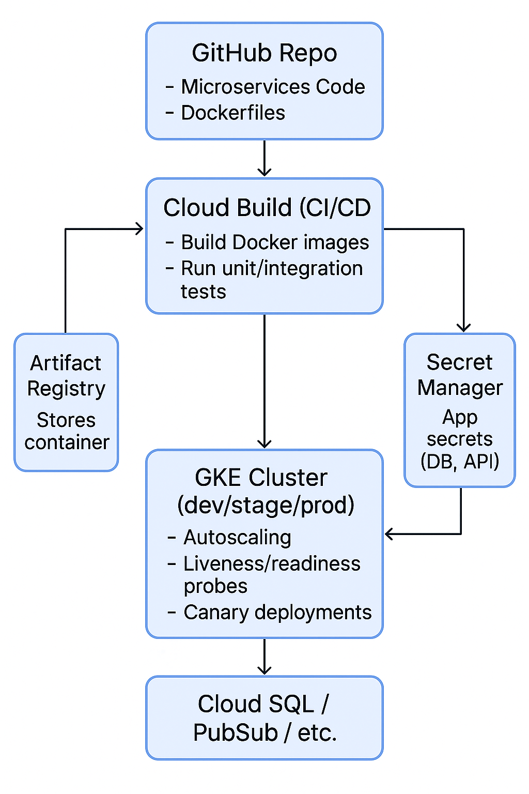

# 🚀 Microservices CI/CD on Google Kubernetes Engine (GKE)

This project demonstrates a production-grade CI/CD pipeline to deploy two containerized microservices using **GitHub Actions**, **Google Cloud Build**, **Artifact Registry**, and **Google Kubernetes Engine (GKE)**.

---

## 📌 Architecture Diagram

 <!-- Replace with actual path if different -->

---

## 🧰 Tech Stack

- Google Kubernetes Engine (GKE)
- Cloud Build
- GitHub Actions
- Docker
- Kubernetes
- Artifact Registry
- Google Secret Manager (optional)
- Cloud SQL (optional)

---

## ✨ Features

- Two Dockerized microservices deployed to GKE
- CI/CD pipeline via GitHub → Cloud Build
- Kubernetes manifests with readiness/liveness probes
- Horizontal Pod Autoscaling (HPA)
- External LoadBalancer for each microservice
- Logs managed via Cloud Logging

---

## 📁 Project Structure

.
├── service1/
│ ├── Dockerfile
│ └── app files (e.g., main.py, package.json)
├── service2/
│ ├── Dockerfile
│ └── app files
├── k8s/
│ ├── service1-deployment.yaml
│ ├── service2-deployment.yaml
├── cloudbuild.yaml
└── README.md


---

## 🚀 Setup Instructions

### 1. Enable Google Cloud APIs
Enable:
- Kubernetes Engine
- Artifact Registry
- Cloud Build

### 2. Create Artifact Registry
```bash
gcloud artifacts repositories create microservices-repo \
  --repository-format=docker \
  --location=us-central1 \
  --description="Docker repo for microservices"
```

### 3. Create a Regional GKE Cluster
```bash
gcloud container clusters create gke-cluster \
  --region=us-central1 \
  --num-nodes=2
```

### 4. Connect to Cluster
```bash
gcloud container clusters get-credentials gke-cluster \
  --region=us-central1
```

### 5. Grant Permissions to Cloud Build
Assign Artifact Registry Writer to Cloud Build service account via IAM & Admin.

### 6. Configure cloudbuild.yaml
Already included in this repo. It:
Builds both microservices
Pushes to Artifact Registry
Applies K8s manifests

### 7. Trigger the Pipeline
Push to the main branch or trigger manually via Cloud Build → Triggers.


🐞 Common Errors & Fixes
| Error Message                                              | Cause                                           | Fix                                                                |
| ---------------------------------------------------------- | ----------------------------------------------- | ------------------------------------------------------------------ |
| `ResponseError: 404 ... clusters.get-credentials`          | Wrong zone or region in cloudbuild.yaml         | Use `CLOUDSDK_COMPUTE_REGION` instead of zone                      |
| `build.service_account specified ... logs_bucket required` | Using a custom service account                  | Add `options.logging: CLOUD_LOGGING_ONLY` in cloudbuild.yaml       |
| `Permission denied` when pushing                           | Cloud Build lacks Artifact Registry permissions | Assign `Artifact Registry Writer` role via IAM                     |
| `kubectl apply failed`                                     | Kubeconfig not set or incorrect region/cluster  | Ensure `get-credentials` step uses correct region and cluster name |


---


